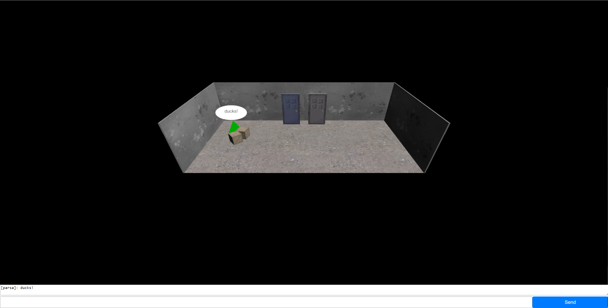

# Ducks
The open world fun fest where you can talk to other players *AND* walk around!

## Installation
To get started with this project, you'll need to install the necessary dependencies. Follow these steps:

1. **Clone the repository:**
   ```bash
   git clone https://github.com/ClaytonWas/Ducks.git
   ```

2. **Navigate to repository directory**

3. **Install dependancies** <br />
    In the directory terminal:
    ```bash
    npm ci
    ```
    OR
    ```bash
    npm install
    ```


## Getting Started

1. **Instance database** <br />
    In the directory terminal:
    ```bash
    node ./client/db/dbs.js
    ```
    This instantiates a database with two template users.
    | username    | password | salt | hash | shape | color | created_at |
    | -------- | ------- | ------- | ------- | ------- | ------- | ------- | 
    | clay  | foobar    | $2b$10$Tpc0EjrF2TegTwUUB7MP5e | $2b$10$Tpc0EjrF2TegTwUUB7MP5eSHZ4M/Knq3FrMDRzpyhiTdpDe5jS8Y2 | sphere | #613583 | 2024-12-25 09:15:00 |
    | parsa | foobar     | $2b$10$NjYK7EhH7jCqRE.rd/TGk. | $2b$10$NjYK7EhH7jCqRE.rd/TGk.IPN6Va2bshvhzKpZ7KommM7yN2JaK5a | cone | #00aa00 | 2024-12-25 09:15:00 |


2. **Run the server** <br />
    In directory terminal 1:
    ```bash
    node ./client/profileServer.js
    ```
    In directory terminal 2:
    ```bash
    node ./server/gameServer.js
    ```

3. **Navigate to host** <br /> 
    Currently set to localhost:3000/

## Run from Docker Container

1. **Docker Setup** <br />

    Set up Docker for your operating system: https://docs.docker.com/get-started/get-docker/

2. **Create container** <br />

    In the root directory terminal, run the following command to build the services defined in docker-compose.yaml
    ```bash
    docker-compose build
    ```

3. **Start and Stop Services** <br />

    To start the containers, run the command
    ```bash
    docker-compose up
    ```
    And navigate to localhost:3000/

    Top stop the containers, press crtl + c

    Alternatively, run and stop the containers from the Docker Desktop client

## Implementation


## Performance

Performace for 4 players on Server, taken using Google Lighthouse


## Code Sources

    For template code used in priorityQueue.js,

    https://www.geeksforgeeks.org/implementation-priority-queue-javascript/

    For the theory and psuedo-code template of the aStar algorithm implemented in movement.js,

    https://www.redblobgames.com/pathfinding/a-star/introduction.html

    For the template code for the TicTacToe minigame,

    https://www.geeksforgeeks.org/simple-tic-tac-toe-game-using-javascript/

    For the template code for the Typing minigame,

    https://github.com/WebDevSimplified/JS-Speed-Typing-Game

## Screenshots


